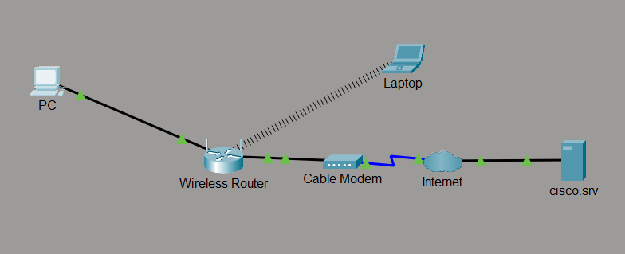
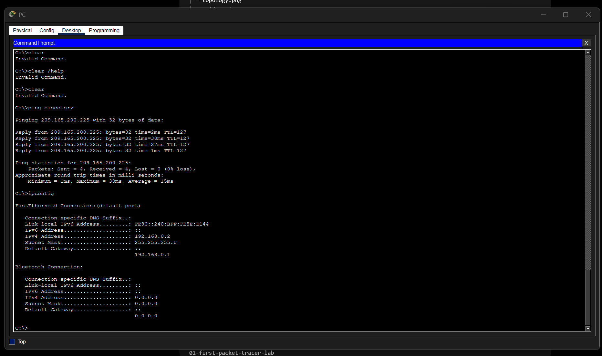
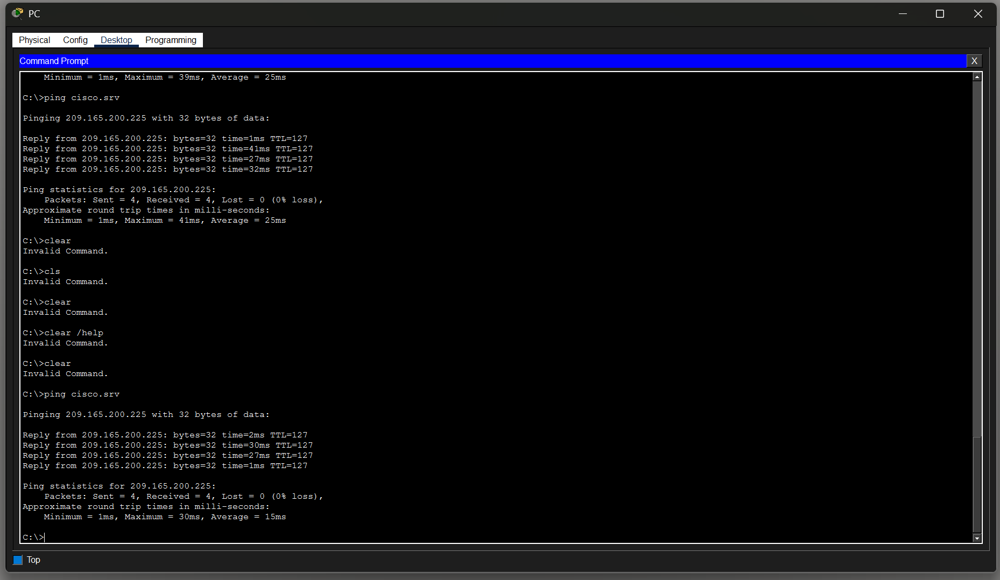
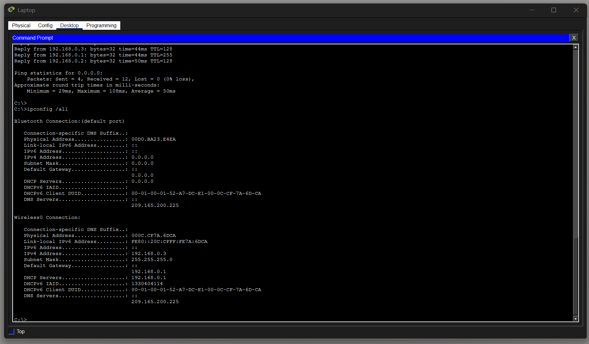
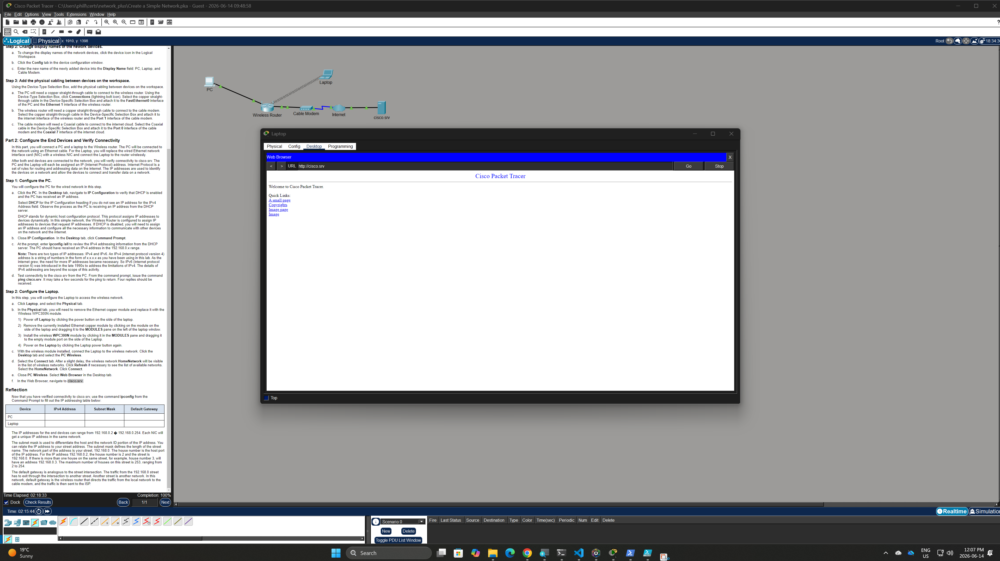

# Create a Simple Network

## Lab Summary

| Field          | Details                                         |
| -------------- | ----------------------------------------------- |
| Status         | Completed                                       |
| Platform       | Cisco Packet Tracer                             |
| Network+ Area  | Networking Concepts and Network Troubleshooting |
| Date Completed | June 14, 2026                                   |
| Difficulty     | Beginner                                        |

## Objective

Build and verify a small network containing both wired and wireless end devices.

The network uses a wireless router to provide local connectivity, DHCP addressing, wireless access, and a default gateway. A cable modem connects the local network to a simulated ISP network and external server.

## Scenario

A small home or office requires:

* One desktop computer connected through Ethernet
* One laptop connected through Wi-Fi
* Automatic IP address assignment
* Access to an external server
* Working DNS name resolution

The desktop computer connects directly to the wireless router. The laptop connects to the same local network through the router's wireless service.

## Topology



## Devices

| Device          | Type                | Purpose                                                            |
| --------------- | ------------------- | ------------------------------------------------------------------ |
| PC              | Wired end device    | Tests Ethernet, DHCP, DNS, and ICMP connectivity                   |
| Laptop          | Wireless end device | Tests wireless connectivity and web access                         |
| Wireless Router | Home router         | Provides switching, Wi-Fi, DHCP, NAT, and default-gateway services |
| Cable Modem     | WAN device          | Connects the Ethernet network to the coaxial ISP connection        |
| Internet Cloud  | WAN simulation      | Represents the service provider network                            |
| `cisco.srv`     | External server     | Used to verify DNS and application connectivity                    |

## Connections

| Device A        | Interface     | Device B        | Interface      | Media                   |
| --------------- | ------------- | --------------- | -------------- | ----------------------- |
| PC              | FastEthernet0 | Wireless Router | Ethernet 1     | Copper straight-through |
| Wireless Router | Internet      | Cable Modem     | Port 1         | Copper straight-through |
| Cable Modem     | Port 0        | Internet Cloud  | Coaxial 7      | Coaxial                 |
| Laptop          | Wireless0     | Wireless Router | Wireless radio | Wi-Fi                   |

## Addressing Table

| Device | Interface     | IPv4 Address  | Subnet Mask     | Default Gateway | Assignment |
| ------ | ------------- | ------------- | --------------- | --------------- | ---------- |
| PC     | FastEthernet0 | `192.168.0.2` | `255.255.255.0` | `192.168.0.1`   | DHCP       |
| Laptop | Wireless0     | `192.168.0.3` | `255.255.255.0` | `192.168.0.1`   | DHCP       |

The DNS server supplied through DHCP was:

```text
209.165.200.225
```

Both end devices received unique addresses in the same `192.168.0.0/24` network.

## Implementation

### Wired desktop

The PC was connected from `FastEthernet0` to the router's `Ethernet 1` interface using a copper straight-through cable.

The PC was configured as a DHCP client and automatically received its addressing information from the wireless router.

The configuration was verified using:

```text
ipconfig /all
```

### Wireless laptop

The laptop was powered off before its wired Ethernet module was removed.

A `WPC300N` wireless module was installed, and the laptop was powered back on. The laptop then connected to the `HomeNetwork` wireless network and received an address through DHCP.

### External connectivity

The PC tested connectivity to the external server using:

```text
ping cisco.srv
```

The laptop verified application-layer connectivity by opening `cisco.srv` in its web browser.

## Validation

| Test                               | Expected Result                           | Actual Result            | Status |
| ---------------------------------- | ----------------------------------------- | ------------------------ | ------ |
| PC receives DHCP configuration     | Valid address in `192.168.0.0/24`         | Received `192.168.0.2`   | Pass   |
| Laptop receives DHCP configuration | Valid address in `192.168.0.0/24`         | Received `192.168.0.3`   | Pass   |
| PC reaches its default gateway     | Four replies from `192.168.0.1`           | Four replies received    | Pass   |
| PC reaches `cisco.srv`             | Hostname resolves and four replies return | Four replies received    | Pass   |
| Laptop joins `HomeNetwork`         | Wireless association succeeds             | Connected successfully   | Pass   |
| Laptop opens `cisco.srv`           | Web page loads                            | Page loaded successfully | Pass   |

## Troubleshooting

During initial testing, the PC could reach the local router but could not reach the external DNS server or `cisco.srv`.

### Initial results

```text
ping 192.168.0.1
```

returned four successful replies, confirming that the local PC-to-router connection was working.

However:

```text
ping 209.165.200.225
```

returned:

```text
Reply from 192.168.0.1: Destination host unreachable.
```

The message showed that the router itself did not have a usable route through its Internet connection.

### Root cause

The wireless router had not obtained a working WAN address from the upstream network.

### Resolution

The router's WAN status was reviewed and the **IP Address Renew** function was used to request a new Internet-side DHCP lease.

After renewing the WAN address, the PC could reach the external network and successfully resolve and ping `cisco.srv`.

| Symptom                                                             | Root Cause                                                      | Resolution                                            |
| ------------------------------------------------------------------- | --------------------------------------------------------------- | ----------------------------------------------------- |
| Local gateway responded, but external destinations were unreachable | Router lacked a working WAN DHCP lease                          | Renewed the router's Internet IP address              |
| `ping cisco.srv` could not find the host                            | DNS server was unreachable because the WAN path was unavailable | Restored the WAN connection and repeated the DNS test |

## Evidence

### PC IP configuration



### PC connectivity test



### Laptop IP configuration



### Laptop browser test



## Lessons Learned

This lab demonstrated that successful local connectivity does not guarantee external connectivity.

The PC could communicate with its default gateway, which confirmed that the Ethernet connection, local IPv4 configuration, and router LAN interface were working. The failed external test showed that the problem was beyond the local LAN.

The response `Destination host unreachable` came from the default gateway itself. This indicated that the router did not have a usable upstream path rather than the destination merely ignoring ICMP traffic.

Testing connectivity in stages helped isolate the problem:

1. Verify the client's local configuration.
2. Test the default gateway.
3. Test an external destination by IP address.
4. Test DNS name resolution.
5. Test the application through a web browser.

Renewing the router's WAN DHCP lease restored the external path. This reinforced the importance of separating LAN, WAN, DNS, and application-layer testing during troubleshooting.

## Repository Files

| File                                   | Purpose                                                         |
| -------------------------------------- | --------------------------------------------------------------- |
| `README.md`                            | Documents the network, addressing, testing, and troubleshooting |
| `topology.png`                         | Shows the completed logical topology                            |
| `evidence/pc-ip-configuration.png`     | Shows the desktop DHCP configuration                            |
| `evidence/pc-ping-test.png`            | Shows successful connectivity to `cisco.srv`                    |
| `evidence/laptop-ip-configuration.png` | Shows the laptop wireless DHCP configuration                    |
| `evidence/laptop-browser-test.png`     | Shows successful browser access to the external server          |

## Completion Checklist

* [x] Required devices were added and renamed
* [x] Correct Ethernet and coaxial connections were installed
* [x] The PC received DHCP configuration
* [x] The laptop wireless module was installed
* [x] The laptop connected to `HomeNetwork`
* [x] Local gateway connectivity was verified
* [x] WAN connectivity was verified
* [x] DNS name resolution was verified
* [x] The PC successfully pinged `cisco.srv`
* [x] The laptop successfully opened `cisco.srv`
* [x] The troubleshooting process was documented
